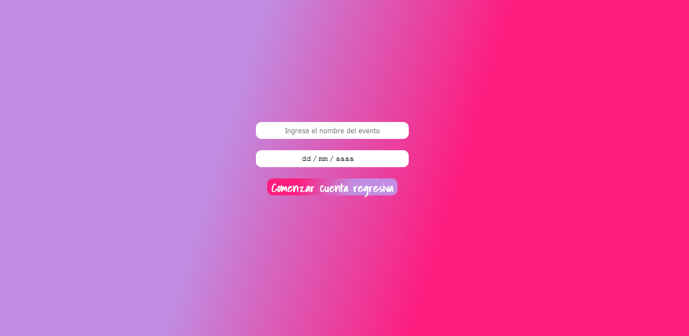
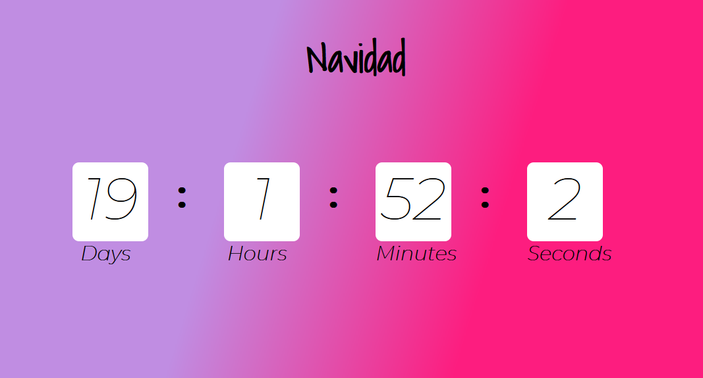

#  Simple countdown-timer
Es una simple cuenta regresiva donde el usuario podra ingresar el nombre del evento y la fecha del evento, obteniendo la diferencia en dias, horas, minutos y segundos.

## Instalacion
`npm install`

### Uso
`npm start`